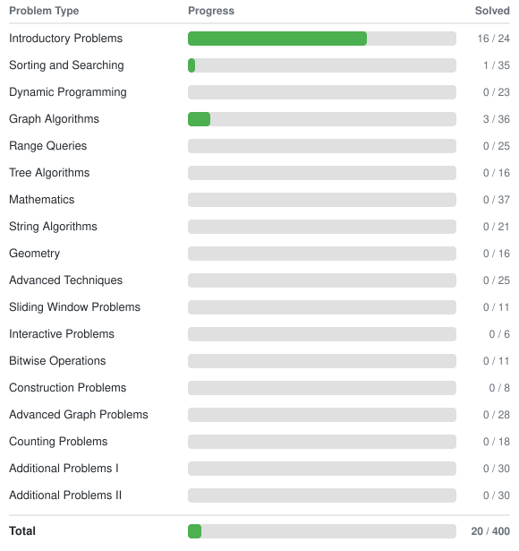

# CSES Solutions

My solutions to the [CSES Problem Set](https://cses.fi/problemset/) in Python. Progress is tracked automatically via GitHub Actions.

CSES profile: [frederickpek](https://cses.fi/user/457384)



---

## Setup

Copy the example environment file and fill in your CSES credentials:

```bash
cp .env.example .env
```

Edit `.env` with your CSES username and password. Credentials are used to log in to CSES to download the full judge test suites and to fetch your solve stats for the table above. Without credentials, only the example test cases shown on each problem page are downloaded.

To enable automatic README updates via GitHub Actions, add `CSES_USERNAME` and `CSES_PASSWORD` as repository secrets under Settings > Secrets > Actions. The workflow runs daily and on each push to `master`, updating the solve counts if they have changed.

## Usage

### Loading a problem

Find the task ID from the problem URL (e.g. `https://cses.fi/problemset/task/1068` &rarr; `1068`), then run:

```bash
./load.sh 1068
```

This will:
- Create the solution file at `problems/<category>/<problem_name>_<task_id>.py` with the template
- Download all test cases to `tests/<task_id>/`

### Testing a solution

```bash
./test.sh 1068
```

Runs the solution against all test cases (examples first, then the full test suite). Each test is run with a 1s time limit and 512MB memory limit, matching CSES judge constraints. Stops on the first failure and reports the verdict:

- **PASS** &mdash; correct output
- **WA** &mdash; wrong answer (shows input, expected, and actual output)
- **TLE** &mdash; time limit exceeded (>1s)
- **MLE** &mdash; memory limit exceeded (>512MB)
- **RTE** &mdash; runtime error (shows the full stack trace)

